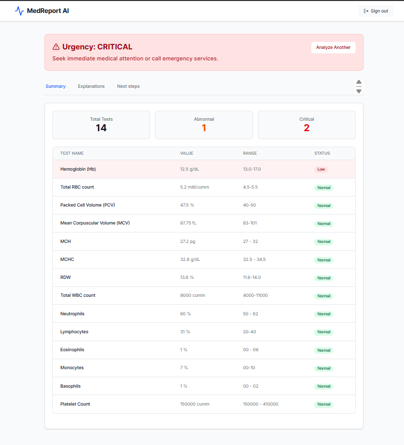
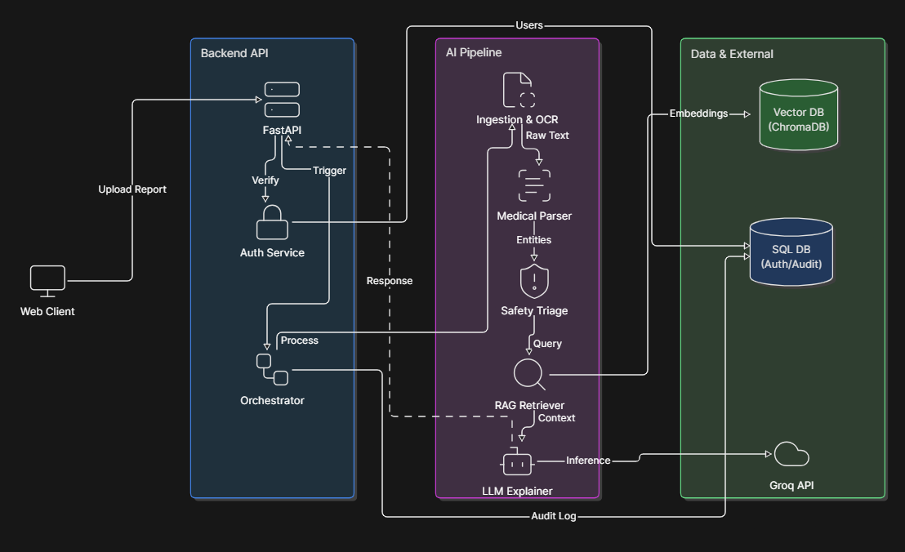

# 🩺 Medical Report Assistant

An AI-powered medical report analysis system that helps users understand laboratory test results through Retrieval-Augmented Generation (RAG), clinical safety triage, and grounded AI explanations.

## 🌐 Live Demo

**Application:** https://medical-report-assistance.vercel.app

## 🎥 Demo Video

[]([https://www.youtube.com/watch?v=YOUR_VIDEO_ID](https://youtu.be/BaKNcsBNP-g))

---

## 📸 Application Preview

### Medical Report Analysis Dashboard



The system automatically analyzes uploaded medical reports, identifies abnormal and critical values, generates patient-friendly explanations, assigns urgency levels, and recommends appropriate next steps.

---

## 🚨 Problem Statement

Medical laboratory reports often contain complex terminology, reference ranges, and clinical indicators that are difficult for patients to interpret.

Patients frequently receive reports showing abnormal values but lack clear explanations regarding:

* What the results mean
* Which findings require attention
* Potential health implications
* Recommended next steps

Medical Report Assistant bridges this gap by combining structured report analysis with Retrieval-Augmented Generation (RAG) to provide grounded and understandable explanations.

---

## ✨ Key Features

* 📄 Medical report upload and processing
* 🧠 AI-powered explanation of laboratory results
* ⚠️ Clinical urgency classification (Normal, Moderate, High, Critical)
* 🔍 Retrieval-Augmented Generation (RAG) pipeline
* 📚 Grounded responses from curated medical knowledge
* 💬 Interactive AI assistant for follow-up questions
* 🔐 Secure authentication and report management
* 🌐 Modern full-stack web application

---

## 🏗️ System Architecture



### High-Level Pipeline

```text
Medical Report
       │
       ▼
Document Processing
       │
       ▼
Test Extraction & Validation
       │
       ▼
Clinical Safety Triage
       │
       ▼
Knowledge Retrieval (RAG)
       │
       ▼
Large Language Model
       │
       ▼
Grounded Medical Explanation
       │
       ▼
Patient-Friendly Insights
```

---

## ⚙️ Tech Stack

| Layer           | Technologies          |
| --------------- | --------------------- |
| Frontend        | Next.js, TypeScript   |
| Backend         | FastAPI, Python       |
| AI Models       | Groq, Llama Models    |
| Embeddings      | Sentence Transformers |
| Vector Database | ChromaDB              |
| Authentication  | JWT                   |
| Deployment      | Vercel                |

---

## 📚 Documentation

Comprehensive project documentation is available in the `docs/` directory.

| Document  | Description                       |
| --------- | --------------------------------- |
| PRD_v1.md | Product requirements and roadmap  |
| TECH.md   | Technical design and architecture |
| API.md    | API reference documentation       |

---

## 🚀 Local Setup

### Backend

```bash
python -m venv .venv
pip install -r requirements.txt

python scripts/setup_knowledge_base.py --reset

uvicorn backend.api.main:app --reload
```

### Frontend

```bash
cd frontend

npm install

npm run dev
```

---


Built by Dhruv Patil
