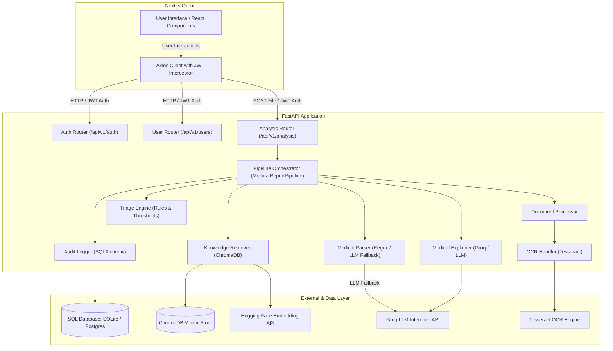

# Technical Design Document (TDD)
## Medical Report Assistant — System Architecture & Developer Guide

This document provides a comprehensive technical overview of the Medical Report Assistant. It details the architecture, component roles, data flow, database schemas, and setup instructions for developers.

---

### 1. Technology Stack

#### Backend (Python 3.10+)
*   **Web Framework:** FastAPI (async endpoints, dependency injection, automatic OpenAPI docs).
*   **Server:** Uvicorn (ASGI web server).
*   **Authentication:** FastAPI-Users with JWT Strategy (stateless token authentication).
*   **Database ORM:** SQLAlchemy 2.0 (with `asyncio` engine).
*   **Relational Databases:** SQLite via `aiosqlite` (development/testing) & PostgreSQL via `asyncpg` (production).
*   **PDF & OCR:** PyPDF2 (text extraction), pytesseract (Tesseract OCR wrapper), pdf2image (convert pages to images for OCR), and Pillow (image processing).
*   **Vector Store:** ChromaDB (persistent vector database).
*   **Embeddings:** Hugging Face Inference API (`sentence-transformers/all-MiniLM-L6-v2`, 384 dimensions) with circuit breaker fallbacks.
*   **LLM Provider:** Groq API (Inference Client accessing Qwen-32B / Llama-3 models).
*   **Logging:** Loguru & Coloredlogs (structured console and file logging).

#### Frontend (React / Next.js)
*   **Framework:** Next.js (App Router, Server-side rendering / Static generation capabilities).
*   **Language:** TypeScript.
*   **Styles:** TailwindCSS v4.
*   **Animations:** Framer Motion (smooth, responsive micro-animations).
*   **HTTP Client:** Axios (configured with request interceptors to auto-inject Bearer JWT tokens).
*   **Icons:** Lucide React.

---

### 2. High-Level Architecture Diagram
The following Mermaid diagram maps out the data flow and communication pathways between the React/Next.js frontend, FastAPI endpoints, the main pipeline orchestrator, and external AI/database services:



---

### 3. Detailed Component Breakdown

The entire system is coordinated through the main orchestrator pipeline, [`MedicalReportPipeline`](file:///d:/Medical_Assitance/backend/orchestrator/pipeline.py), which implements the end-to-end processing of a report in six distinct steps:

```
[Uploaded File] 
       │
       ▼
 1. Ingestion & Extraction (DocumentProcessor / OCR) ──► Extracted Text
       │
       ▼
 2. Structuring & Parsing (MedicalReportParser) ───────► ParsedReport (JSON/Objects)
       │
       ▼
 3. Safety Triage (TriageEngine & NextSteps) ──────────► Urgency Level & Next Steps
       │
       ▼
 4. Knowledge Retrieval (KnowledgeRetriever / RAG) ────► Contextual Medical Texts
       │
       ▼
 5. AI Patient Explanation (MedicalExplainer) ─────────► Grounded Explanations
       │
       ▼
 6. Compliance Trail (AuditLogger) ────────────────────► Database Audit Logs
       │
       ▼
[Response Payload]
```

#### 3.1 Step 1: Ingestion & OCR Extraction
*   **File Path:** [`backend/ingestion/document_processor.py`](file:///d:/Medical_Assitance/backend/ingestion/document_processor.py)
*   **Role:** Handles uploaded file verification (size and type extensions) and converts files to raw strings.
*   **OCR Logic:** Attempts to read text from PDFs directly using `PyPDF2` (fastest). If character count is too low (< 100 characters), it assumes the document is scanned. It then converts PDF pages to images using `pdf2image` and runs `pytesseract` to perform OCR.

#### 3.2 Step 2: Structured Data Parsing
*   **File Path:** [`backend/parser/medical_parser.py`](file:///d:/Medical_Assitance/backend/parser/medical_parser.py)
*   **Role:** Extracts raw measurements, reference ranges, and names from the text.
*   **Regex Extraction:** Scans text against common regex patterns (defined in [`patterns.py`](file:///d:/Medical_Assitance/backend/parser/patterns.py)) for lab test metrics.
*   **LLM Fallback:** If regex detects fewer than 3 tests, the system invokes [`LLMParser`](file:///d:/Medical_Assitance/backend/parser/llm_parser.py), which sends the text to Groq (JSON-mode) using a specialized medical parser system prompt.

#### 3.3 Step 3: Safety Triage Engine
*   **File Path:** [`backend/safety/triage_engine.py`](file:///d:/Medical_Assitance/backend/safety/triage_engine.py)
*   **Role:** Categorizes result severity and sets overall report urgency.
*   **Triage Rules:** Evaluates metrics against thresholds (defined in [`rules.py`](file:///d:/Medical_Assitance/backend/safety/rules.py)) classifying them into `normal`, `low`, `high`, `critical_low`, or `critical_high`.
*   **Next Steps:** Utilizes [`NextStepsGenerator`](file:///d:/Medical_Assitance/backend/safety/next_steps.py) to append targeted nutritional/medical recommendations for abnormal values (e.g., advising hydration for high hemoglobin or foods for low potassium).

#### 3.4 Step 4: RAG Retrieval (Vector Database)
*   **File Path:** [`backend/rag/knowledge_base.py`](file:///d:/Medical_Assitance/backend/rag/knowledge_base.py) & [`retriever.py`](file:///d:/Medical_Assitance/backend/rag/retriever.py)
*   **Role:** Pulls authoritative medical data related to parsed tests.
*   **Embeddings API:** Requests vectors from Hugging Face for the query text. If Hugging Face is down or rate-limiting, a circuit breaker opens and returns a zero vector to prevent crashing the pipeline.
*   **Vector Search:** Searches ChromaDB for documents matching the test name with a similarity threshold of `0.60`.

#### 3.5 Step 5: Patient-Friendly Explanations
*   **File Path:** [`backend/llm/explainer.py`](file:///d:/Medical_Assitance/backend/llm/explainer.py)
*   **Role:** Generates an empathetic, easy-to-read explanation for each abnormal test (up to 5) and normal test (up to 2).
*   **Prompt Formatting:** Injecting test metadata and retrieved ChromaDB contexts into templates built by [`PromptBuilder`](file:///d:/Medical_Assitance/backend/llm/prompt_builder.py).
*   **Safety Guards:** Filters out reasoning tokens (e.g., `<think>` tags) and appends disclaimers and critical warnings.

#### 3.6 Step 6: Audit & Compliance Logging
*   **File Path:** [`backend/audit/audit_logger.py`](file:///d:/Medical_Assitance/backend/audit/audit_logger.py)
*   **Role:** Generates SQL log entries for each workflow step.
*   **Session Tracking:** Assigns a unique UUID `session_id` to trace the entire file workflow (upload -> extraction -> parse -> alerts -> errors).

---

### 4. Database Schema Design

The backend manages two independent databases (or two sets of tables in PostgreSQL): one for User Accounts and one for Audit compliance.

```
       User Database Table (users)
  ┌───────────────────────────────────┐
  │  id: Integer (PK)                 │
  │  email: String(255) (Unique)      │
  │  hashed_password: String(1024)    │
  │  is_active: Boolean               │
  │  is_superuser: Boolean            │
  │  is_verified: Boolean             │
  └───────────────────────────────────┘

       Audit Log Table (audit_logs)
  ┌───────────────────────────────────┐
  │  id: Integer (PK)                 │
  │  created_at: DateTime             │
  │  event_type: String(50)           │  <-- 'upload', 'parse', 'llm_call', 'alert'
  │  session_id: String(64)           │
  │  user_id: String(64) (Nullable)   │
  │  input_data: JSON (Nullable)      │
  │  output_data: JSON (Nullable)     │
  │  metadata: JSON (Nullable)        │
  │  error: Text (Nullable)           │
  └───────────────────────────────────┘
```

---

### 5. Setup & Configuration

#### 5.1 Environment Variables (`.env`)
Create a `.env` file in the project root:
```env
# General
ENVIRONMENT=development
DEBUG=true
SECRET_KEY=generate-a-secure-random-key-here

# Databases (Defaults to local SQLite)
DATABASE_URL=sqlite:///./audit.db

# API Credentials
GROQ_API_KEY=gsk_your_groq_api_key
HUGGINGFACE_API_KEY=hf_your_huggingface_api_key

# Frontend Configuration (for CORS)
CORS_ORIGINS=http://localhost:3000,http://localhost:8501
```

Create a `.env.local` file in the `frontend` directory:
```env
NEXT_PUBLIC_API_URL=http://127.0.0.1:8000/api/v1
```

#### 5.2 System Prerequisites
To run PDF image conversions and OCR extraction, the host machine must have the following tools installed and added to the system PATH:
*   **Tesseract OCR Engine:** [Installation Guide](https://github.com/tesseract-ocr/tesseract)
*   **Poppler (required for pdf2image):** [Installation Guide](https://github.com/oschwartz10612/poppler-windows)

---

### 6. Developer Commands Reference

#### 6.1 Backend Workspace Setup
```bash
# 1. Create virtual environment
python -m venv .venv
.venv\Scripts\activate  # Windows
source .venv/bin/activate  # macOS/Linux

# 2. Install dependencies
pip install -r requirements.txt
```

#### 6.2 Pre-populating the RAG Knowledge Base
Before querying the system, populate the ChromaDB vector database with medical source documentation:
```bash
# Ingest default medical knowledge text file
python scripts/setup_knowledge_base.py --reset
```

#### 6.3 Running Backend API Server
```bash
# Start server on http://127.0.0.1:8000
uvicorn backend.api.main:app --reload
```

#### 6.4 Running Automated Tests
```bash
# Run unit and integration tests
python scripts/run_tests.py
```

#### 6.5 Frontend Workspace Setup
```bash
cd frontend

# Install Node modules
npm install

# Start Next.js development server on http://localhost:3000
npm run dev
```
